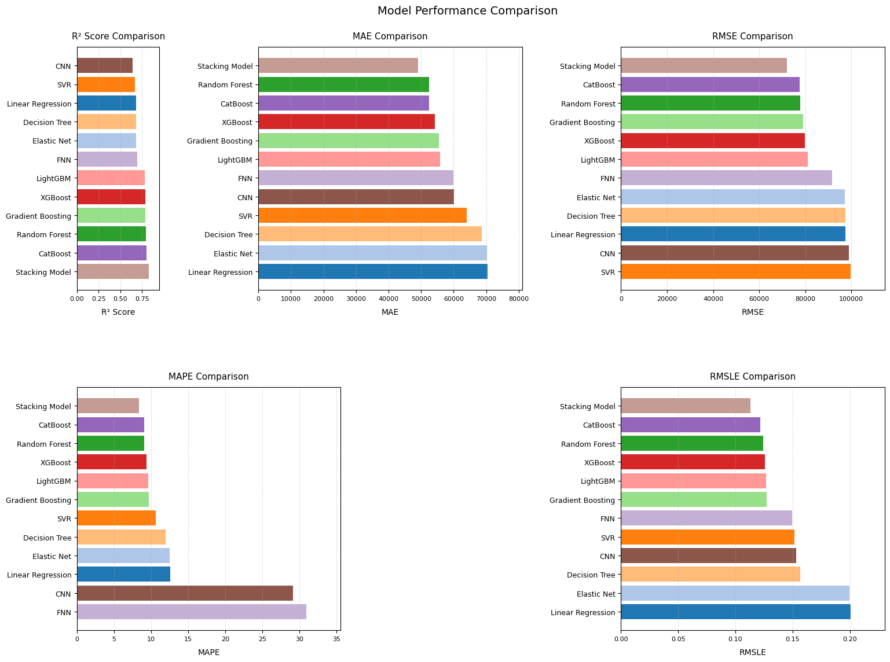
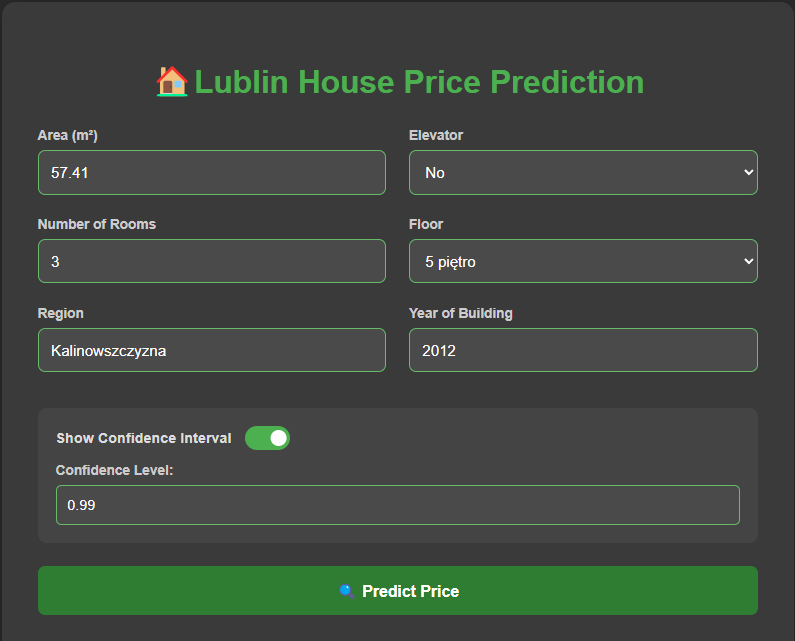
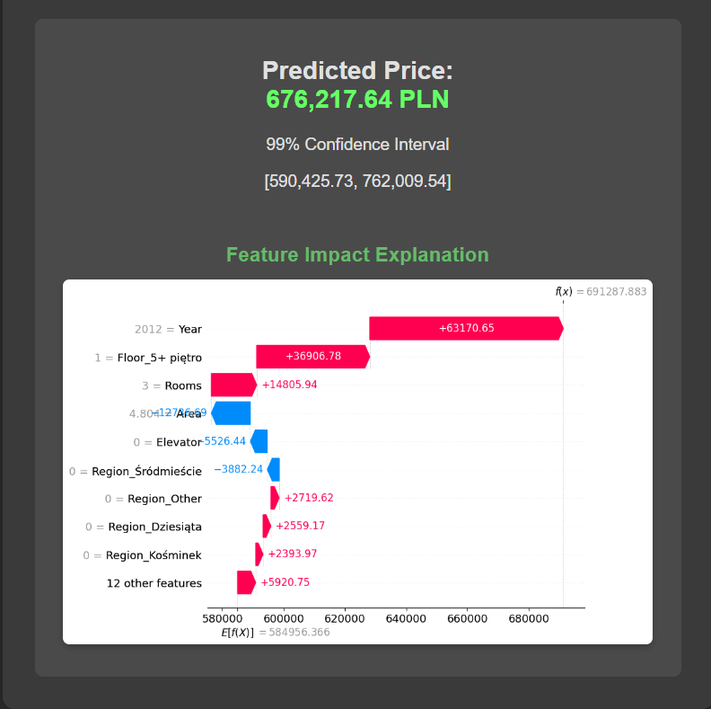

# 🏠 Lublin House Price Prediction

https://davydantoniuk.github.io/lublin-house-price-predict/

This project aims to predict house prices in Lublin using various machine learning and deep learning models. The dataset includes property listings from [Otodom](https://www.otodom.pl/pl/wyniki/sprzedaz/mieszkanie/lubelskie/lublin/lublin/lublin?viewType=listing&page=) web page.

## **Results**

-   After comparing various models, the **Random Forest Regressor** and **CatBoost** models showed the best performance and were combined in a stacking model.
-   The FastAPI app allows easy interaction with the trained model for real-time house price predictions.

## Visualizations

1. **Model Results Comparison**: A bar plot comparing the performance of all models, showcasing their metrics.
   

2. **Prediction Example**:
    - **Input Example**: The last advertisement for sale on otodom.
      
    - **Predicted Output**: The model's prediction.\
      
      

## 📁 **Project Structure**

### 1. Introduction

-   Overview of the project goals and objectives.

### 2. Data Collection & Preprocessing

-   Scraped property data and handled issues like:
    -   Data type conversions
    -   Duplicate listings
    -   Missing values with KNN imputation
    -   One-hot encoding for categorical features

### 3. Exploratory Data Analysis (EDA)

-   Performed detailed analysis on:
    -   Price and area distribution
    -   Price per sqm
    -   Floor and regional analysis
    -   Temporal trends and property characteristics

### 4. Feature Engineering & Data Preparation

-   Transformed key features:
    -   Floor and regional-based transformation
    -   Outlier detection and handling
    -   Train-test-validation split

### 5. Machine Learning Models

-   Compared various ML models:
    -   Linear Regression, Elastic Net, Decision Trees, Random Forest, Gradient Boosting, XGBoost, LightGBM, CatBoost
    -   Built a stacking model for better performance

### 6. Deep Learning Models

-   Developed deep learning models:
    -   Feedforward Neural Network
    -   Convolutional Neural Network

### 7. Model Comparison and Interpretation

-   Compared performance metrics of all models
-   Analyzed feature importance
-   Investigated worst predictions

### 8. Final Model & Predictions

-   Saved the best-performing model
-   Made predictions on new data

### 9. FastAPI App

-   Developed a FastAPI-based web application to:
    -   Serve the best model
    -   Provide real-time predictions

## Installation & Usage

### Run the FastAPI App

1. **Clone the repository**:
    ```bash
    git clone https://github.com/davydantoniuk/lublin-house-price-predict.git
    cd lublin-house-price-predict/app
    ```
2. **Install the required packages**:

    ```bash
    pip install -r requirements.txt
    ```

3. **Run the FastAPI app**:

    ```bash
    uvicorn app:app --reload
    ```

4. Access the app: Open your browser and navigate to `http://127.0.0.1:8000`

### Build the Docker Image

1. **Clone the repository**:
    ```bash
    git clone https://github.com/davydantoniuk/lublin-house-price-predict.git
    cd lublin-house-price-predict/app
    ```
2. **Build the Docker image**:

    ```bash
    docker build -t lublin-house-price-predict .
    ```

3. **Run the Docker container**:

    ```bash
    docker run -p 80:80 lublin-house-price-predict .
    ```

4. Access the app: Open your browser and navigate to `http://localhost:80`
