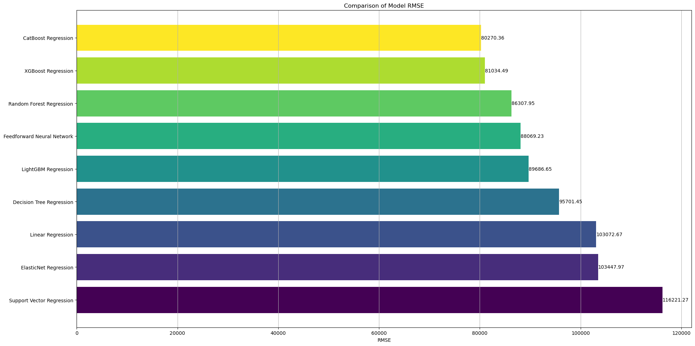
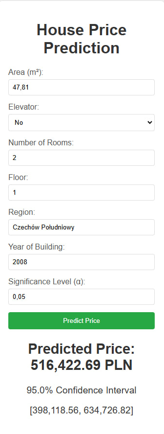

# 🏠 Lublin House Price Prediction

This repository contains an end-to-end project focused on predicting house prices in Lublin, Poland, using advanced machine learning (ML) and deep learning (DL) techniques. The project includes web scraping, data preprocessing, feature engineering, model development, and deployment of a prediction application.

## Project Highlights

- **Data Collection**:
  - Scraped house sale advertisements from [Otodom](https://otodom.pl) to create a rich dataset.
- **Data Analysis & Visualization**:
  - Performed exploratory data analysis (EDA) to uncover insights about house prices.
  - Created visualizations to summarize key findings.
- **Feature Engineering**:
  - Engineered new features to enhance the dataset's predictive capabilities, improving model performance.
- **Model Development & Comparison**:
  - Built and evaluated multiple machine learning (ML) models (e.g., CatBoost, XGBoost, Random Forest) and deep learning (DL) models.
  - Compared model results to identify the best-performing model.
- **Model Optimization**:
  - The CatBoost algorithm outperformed others and was selected for final deployment.
  - Trained the selected model on the entire dataset for optimal performance, achieving an `R^2` score of 0.9.
- **Prediction App**:
  - Developed a web application using **FastAPI** for real-time house price predictions.
  - The app allows users to input house details and instantly receive price predictions.
- **Comprehensive Documentation**:

  - Included a detailed Jupyter Notebook (`price_prediction.ipynb`) that documents every step of the project, from data collection to model deployment.

  ## Visualizations

1. **Model Results Comparison**: A bar plot comparing the performance of all models, showcasing their metrics.
   

2. **Prediction Example**:
   - **Input Example**: The last advertisement for sale on otodom.
     
   - **Predicted Output**: The model's prediction.\
     

## Installation & Usage

1. **Clone the repository**:
   ```bash
   git clone https://github.com/davydantoniuk/lublin-house-price-predict.git
   cd lublin-house-price-predict
   ```
2. **Install the required packages**:

   ```bash
   pip install -r requirements.txt
   ```

3. **Run the FastAPI app**:

   ```bash
   cd app
   uvicorn price_predict:app --reload
   ```

4. Access the app: Open your browser and navigate to `http://127.0.0.1:8000`
